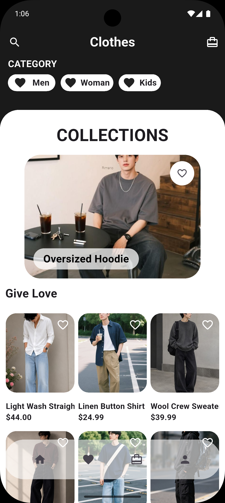

# Shopping App — UI Practice

A shopping app UI written by hand in 2024 to practise Flutter layouts.
This is an unfinished practice project: it uses sample images and hardcoded data.

## Screenshot



## Status

| Screen                                                          | Status                                       |
| --------------------------------------------------------------- | -------------------------------------------- |
| Home (categories, collections, product grid, bottom navigation) | Layout complete                              |
| Cart                                                            | Layout only — items and counts are hardcoded |
| Favourites                                                      | Layout only — items and counts are hardcoded |
| Product detail                                                  | Placeholder                                  |
| Profile                                                         | Placeholder                                  |

- Cart and favourites state classes (Provider / ChangeNotifier) are written but not yet connected to the screens.
- Updated in 2026: Android Gradle Plugin and Gradle upgraded so the project builds with current Flutter.

## Tech stack

Flutter (Dart), Provider

## Running locally

```bash
flutter pub get
flutter run
```
